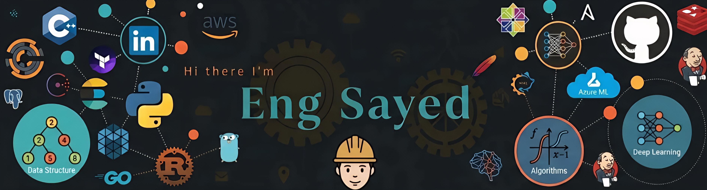

<!-- Profile Banner -->
<p align="center">
  
</p>

<h1 align="center">Hi, I'm Sayed Mohamed 👋</h1>

<p align="center">
  <b>AI Engineering Student | Artificial Intelligence & Machine Learning</b>
</p>

<p align="center">
  🎓 Faculty of Engineering — New Ismailia University
</p>

---

## 👨‍💻 About Me

I'm **Sayed Mohamed**, an Artificial Intelligence Engineering student passionate about programming, problem solving, and building my skills in Artificial Intelligence and Machine Learning.

- 🎓 AI Engineering Student
- 💻 Programming with **C++ & Python**
- 🧠 Object-Oriented Programming (OOP)
- 🌳 Data Structures & Algorithms
- 🤖 Machine Learning
- 🧠 Artificial Intelligence
- 📚 Always learning and improving my technical skills
- 🚀 Interested in building useful AI-powered solutions

---

## 🛠️ Skills & Technologies

<p align="left">


</p>

---

## 🌍 Languages

- 🇪🇬 **Arabic** — Native
- 🇬🇧 **English** — Spoken
- 🇹🇷 **Turkish** — Spoken

---

## 📚 Interests & Hobbies

- 📖 Reading and memorizing the **Quran**
- 🕌 Caring about **prayer and worship**
- 🏋️ Going to the **gym**
- ⚽ Playing and following **football**
- 💻 Programming and technology
- 🤖 Artificial Intelligence & Machine Learning
- 🌱 Self-development and continuous learning

---

## 🎯 My Goal

> To become a skilled **Artificial Intelligence Engineer**, continuously improve my knowledge, and build impactful solutions using technology and AI.

---

## 💡 What I'm Learning

```text
C++                 ███████████████░░░
Python              █████████████░░░░░
Data Structures     ████████████░░░░░░
OOP                 ████████████░░░░░░
Machine Learning    █████████░░░░░░░░░
Artificial AI       ████████░░░░░░░░░░
